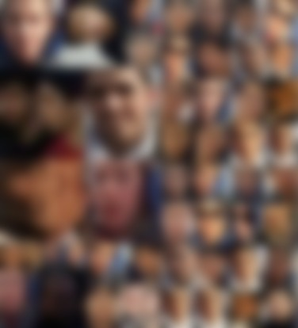
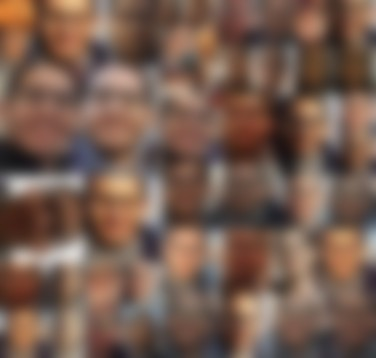
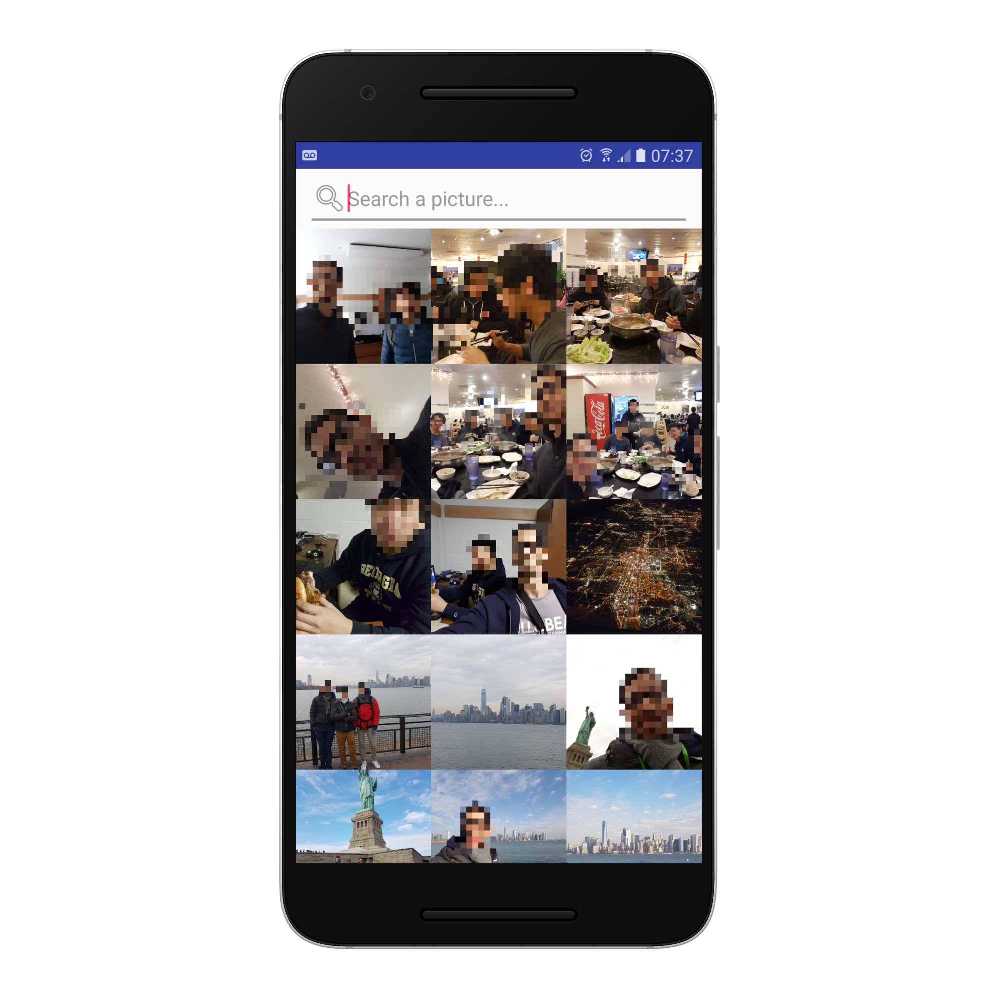
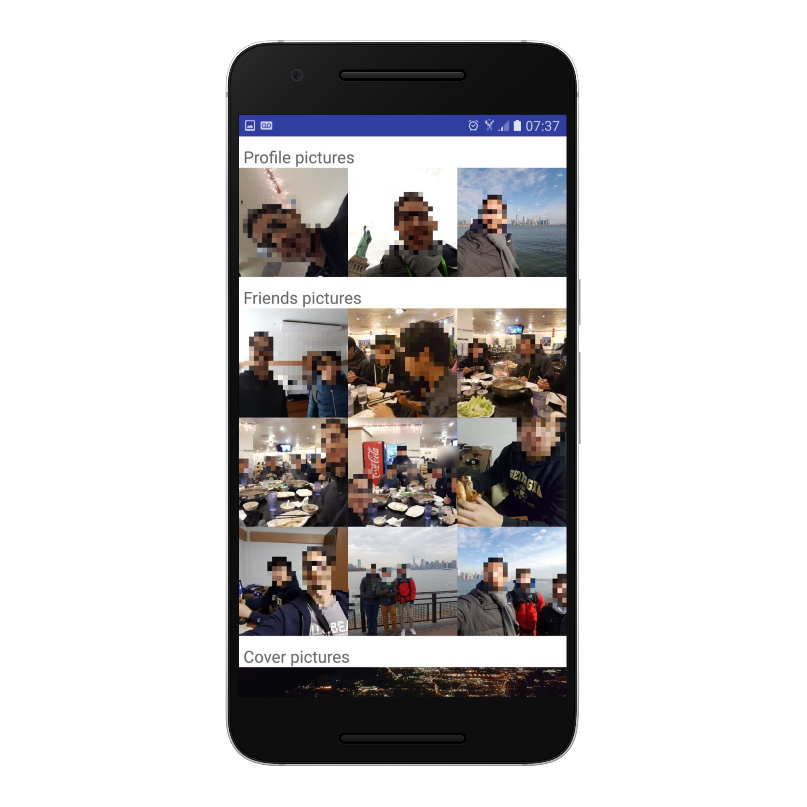
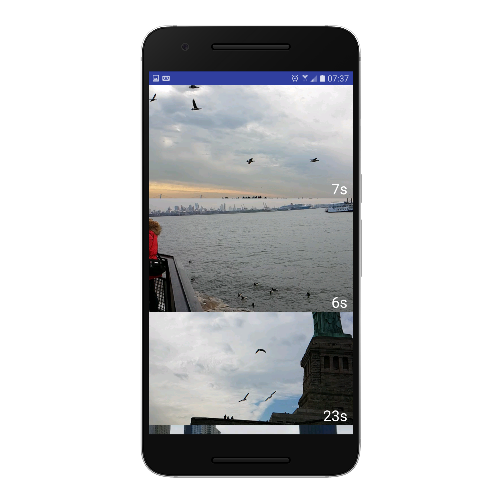
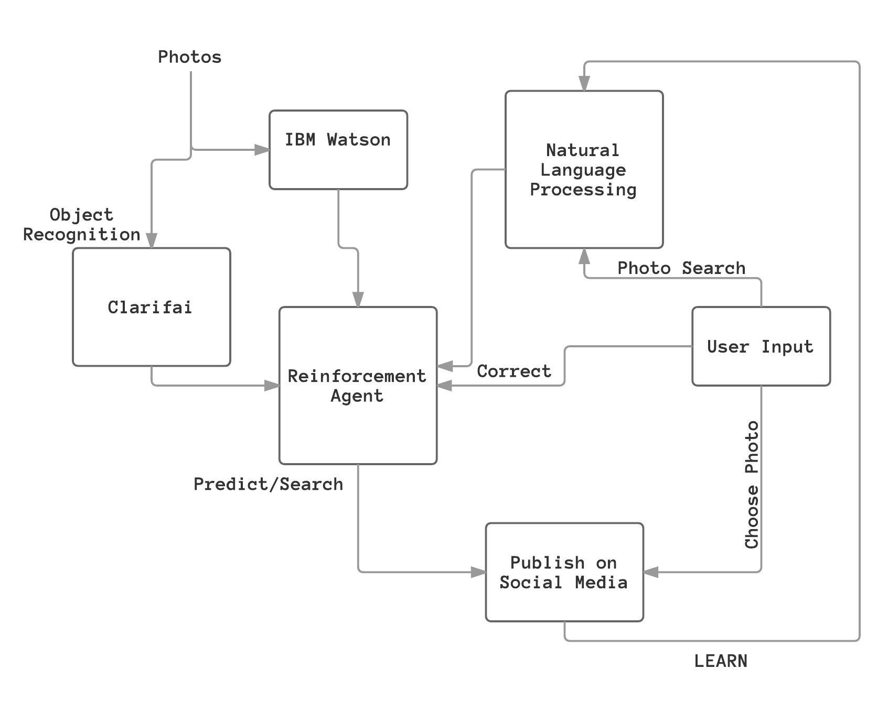

# Lena

## Table of Contents
- [Overview](#overview)
- [License](#license)
- [Machine Learning Image Samples](#machine-learning-samples)
- [Screenshots](#screenshots)
- [Machine Learning and More](#machine-learning-and-more)
- [Our Infrastructure](#our-infrastructure)
- [API](#api)

## Overview
What is Lena and why is it important? Lena is a photo library management tool designed to bring machine learning into the fold and allow you to surface your best photos with minimal effort. Named for Lena Söderberg, the model in the classic machine learning and computer vision test photo, Lena allows one to search through his/her library using natural language, to see the best photos recommended for social media, as well as the best parts of his/her videos.

## License
[GNU GENERAL PUBLIC LICENSE v3](LICENSE.md)

## Machine Learning Samples

__NOTE__: Displayed here (on 1/22/17) will be photo diagrams of the training set, as well as the application, in their entirety. We have decided to do this for judging purposes, but following this stage the diagrams and screenshots will be blurred to protect the identities of those in our training set.

* Negative examples:

* Positive examples:

## Screenshots

Gallery View (Main Application Screen):

Profile/Suggested Pictures Page:

Video Highlights Page:

## Machine Learning and More
Now that the intent of Lena is understood, the design of the platform can be explained. Following, the machine learning pipeline will be disected.

Here is a visual representation of the following pipeline:

1. We start by culling all of the users photos for analysis. Given the issue with obtaining the rights to manipulate photos, upload them to servers, etc. the approach that was taken here was to leverage an Android application that requested access to the user's gallery. From here two things are done. 
	1. As it pertains to detecting the user: all of the photos are sent through a custom classifier that is run on IBM Watson Visual Recognition. With the use of the user input through the custom reinforcement agent (explained later), the classifier is reinforced, and thus able to detect pictures of the user.
	2. As it pertains to searching, and suggestions, the photos are sent to Clarifai. The output of this operation is a structured set containing what will here on be referred to as `tags`. These tags contain the entities and concepts within the image. I.E. a key photo within the training set included the user visiting the Statue of Liberty. The return of this operation would include details such as the picture was taken in New York, it is at a historical site, the tags pertaining to the Statue of Liberty as well as about the user, i.e. the photo potentially contained water, the sky, birds, boats, etc. In short, this is entity extraction.
2. The data from the prior operations is taken into account in our robust, service indepent reinforcement agent. Here, depending on the context we are able to suggest the most pertinent images. So, how is this done? With regard to the Profile Photo, Cover Photo, Friend Photo selections, etc we use reinforcement learning. Based on the input of the user stating whether or not the photo contains them, we use this leveraged against the results of the IBM Watson Visual Recognition API which allows us to detect and isolate faces to best select the photos that contain the user. Using this information we're then able to reccomend the friend photos, now knowing which are the best photos of the user, and thus by extension those of his/her friends. With cover photos the operation is eaiser given that we know the entities in the photos and we're simply looking for those that lack a significant amount of humans/large objects in the foreground. The reason for the significance of this agent, and why it is being discussed at length is because of it's *lack* of bias. There is nothing that causes this agent to be tied to either the IBM or Clarifai APIs, but rather just to seek the type of output produced by them. In this manner we have produced a robust system for the pieces can be interchanged without significantly altering the end result.
3. The reinforcement agent will seek to recommend the best photos to the user for use on social media and this is done by constantly incoporating the user input (including but not limited to the text input by the user after being run through a (later discussed) natural language processing algorithm) and by querying through social media platforms, see our Twitter integration, to get an understanding of what constitutes hashtags. This is important because often the thing which the user is searching for is not the "whole picture". I.E. often a hashtag follows a couple of sentences of text highlighting the main point or purpose. Thus, we sought to understand this by querying for hashtags in our system on Twitter and running these results through the NLP algorithm where their true meaning could be derived.
4. A significant amount of work which is done in the learning stage was described in part 3. To reinforce the stated concepts: the input of the user is taken into account and embedded into the reccomendation engine of the system. IE, all of the photos within the system already contain tags of known entities, which we can query on the server. In the learning phase we do not alter these tags, but instead we seek to understand their importance and the relative weighting for the user. This is important because when the user goes to search through their photo library (see our screenshots) we want to be able to recommend to them the most prescient photos. Thus the understanding of their language, and thus their priorities, is of the utmost importance.

## Our Infrastructure
Our service is broken into the core components:
- Lena Android Application
	- Built and tested on Android 6.0 Marshmallow.
- Lena Web Service (Backs the Pipeline)
- [`Highlighter`](https://github.com/vontell/Highlights), the ML component, which is able to extract key entities from videos and display only the most important pieces.

## API

### POST

- `/api/gallery`

	This is the API that is called to do the searching within the gallery (i.e. the main page of the application). On first call you need to provide a structured data set that includes tags and query parameters so that we're able to take them into account when we run the query through the NLP algorithm.

- `/api/tag_upload`

	On call you need to provide a structured data set that includes the filenames of the images as well as the tags/descriptors for each of them (this should be the result of a call to Watson/Clarifai). This is in effect "uploading the photo library" to the server so that subsequent searches can be conducted.
	
- `/api/proifle_picture_upload`
	
	To provide the reccomendations for the best profile pictures, the photos that are to be taken into consideration, ie those that have already been through a preliminary round in the classifier, are submitted to this endpoint and run through `faces.py` where the results include whether or not the subject of the picture is the user, and thus whether or not the image should be included in the reccomendation.

- `/api/videos`

	Call this API to get the result of `highlighter.py` on the users videos.

	**NOTE**: This is currently only a stub. Because of time limitations we did not implement video uploading or management in the API. Instead, this API assumes that the videos are already on the server and that `runner.py` has been run and thus the results can be delivered. To integrate this with the API:

		- Include video upload.
		- Query `highlighter.py` from within `server.py` instead of invoking an external script.
		- Check for updates and new videos.

### GET

- `/api/videos`

	Call this API to get the result of `highlighter.py` on the users videos.

	**NOTE**: This is currently only a stub. Because of time limitations we did not implement video uploading or management in the API. Instead, this API assumes that the videos are already on the server and that `runner.py` has been run and thus the results can be delivered. To integrate this with the API:

		- Include video upload.
		- Query `highlighter.py` from within `server.py` instead of invoking an external script.
		- Check for updates and new videos.